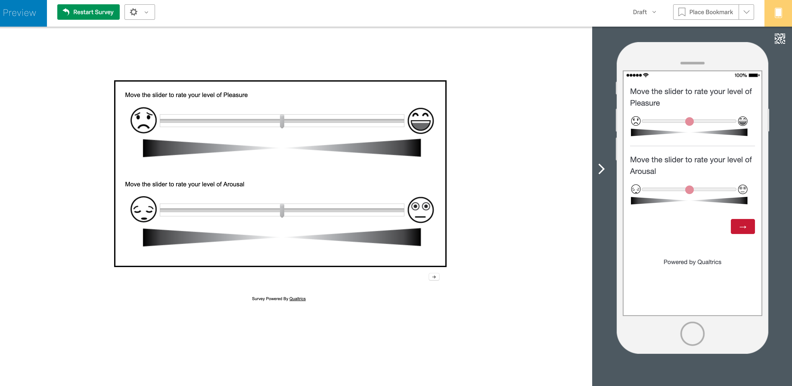
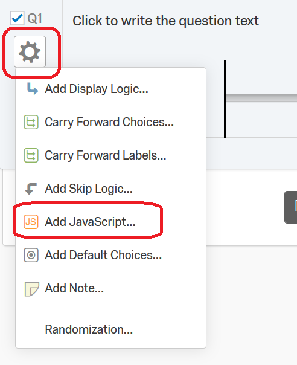
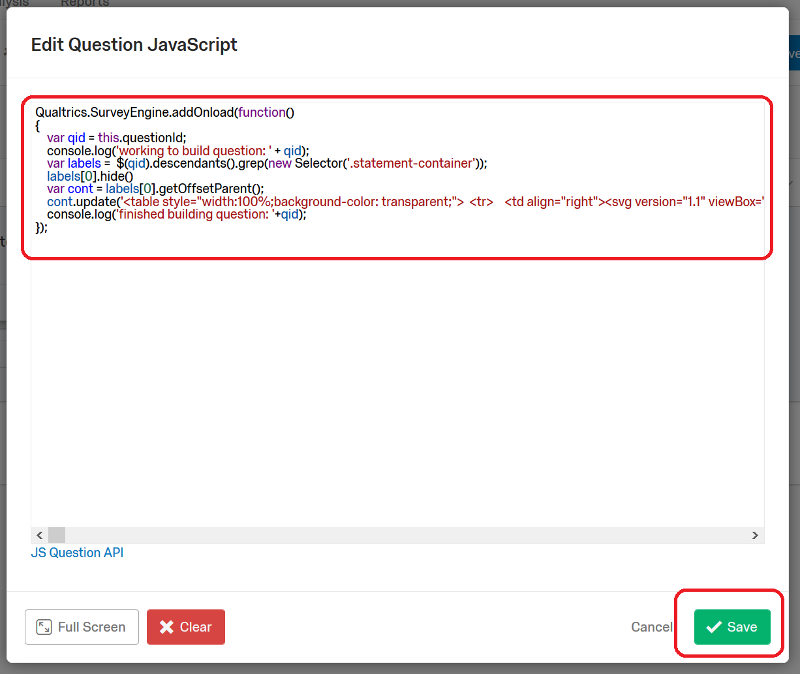

# The Affective Slider on Qualtrics

This folder has the necessary code to implement the Affective Slider in Qualtrics.

You should end up with this: 

## Setup

- Create a new slider element: 
- Set to 1 choice and 0 grid marks: 
- Position the slider at 50: 
- Hide the value and force a response: 
- Add JS: 
- Copy in JS from [arousal.js](arousal.js) and save: 
- Copy the question: 
- Open JS for second question: 
- Copy in JS from [pleasure.js](pleasure.js) and save: 
- Randomize the block of questions: 
  - 
  - 
