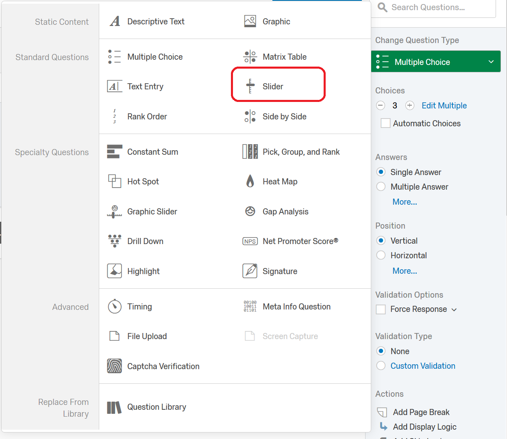
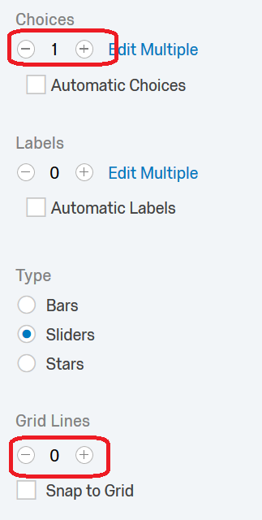
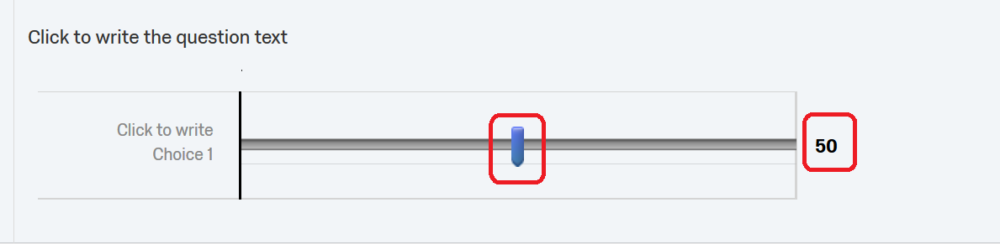
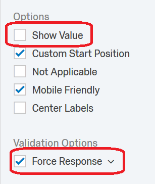
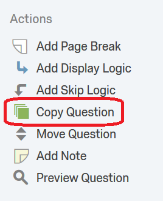
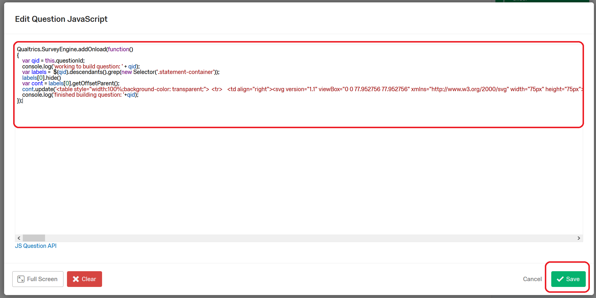
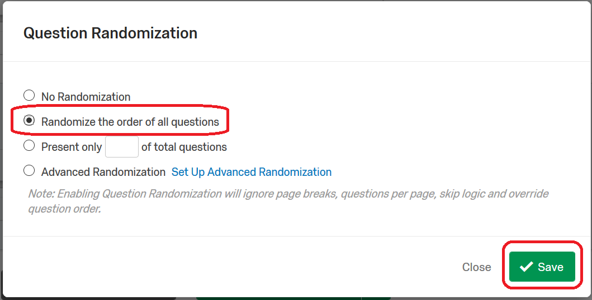

# The Affective Slider on Qualtrics

This folder has the necessary code to implement the Affective Slider in Qualtrics.
I would share the questions directly, but can't find a way to do that (if you
know how, let me know -mjsobrep).

You should end up with this: 

## Setup, import:
The easiest way to get these elements is to import the [Affective_Slider_shared](Affective_Slider_shared.qsf)

## Setup, custom:
Alternatively you can setup from scratch

- Create a new slider element: 
- Set to 1 choice and 0 grid marks: 
- Position the slider at 50: 
- Hide the value and force a response: 
- Add JS: 
- Copy in JS from [arousal.js](arousal.js) and save: 
- Copy the question: 
- Open JS for second question: 
- Copy in JS from [pleasure.js](pleasure.js) and save: 
- Randomize the block of questions: 
  - 
  - 
